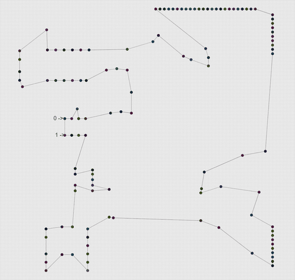
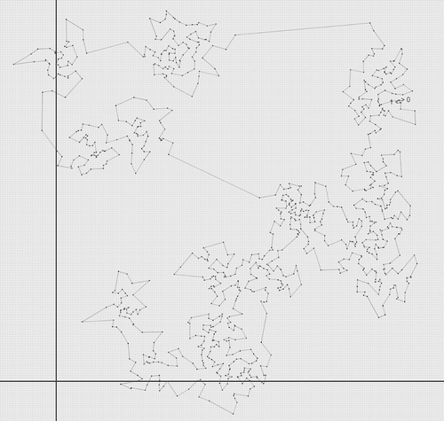
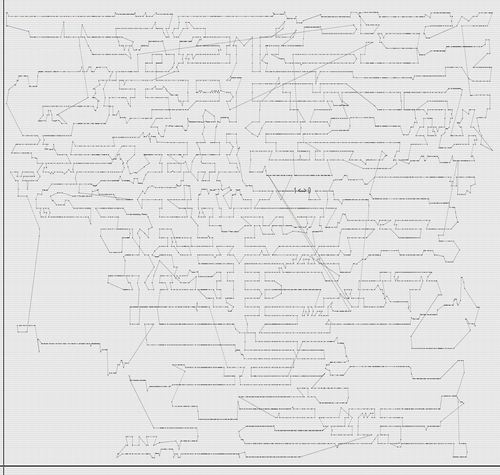

# ant-colony-tsp

Bu Proje kapsamında gezgin satıcı problemi **5**, **124**, **1000**, **5915**, **11849** ve **85900** boyutlu veri setleri için **Ant-Colony** ve **Brute-Force** algoritmaları ile ele alınmıştır.  

# Gereksinimler
.NET Core SDK

# Kullanım
dotnet Program.cs

## 5 Boyutlu Veri Seti İçin:

5 Boyutlu veri seti için **Brute-Force** algoritması kullanılmıştır.
 

| Deneme   | Boyut | Çalışma Zamanı | Maliyet |
| :------- | :---: | -------------- | :------ |
| 1.Deneme |   5   | 0,2505 ms      | 3       |
| 2.Deneme |   5   | 0,2833 ms      | 3       |
| 3.Deneme |   5   | 0,2511 ms      | 3       |
| 4.Deneme |   5   | 0,2547 ms      | 3       |
| 5.Deneme |   5   | 0,2462 ms      | 3       |

En iyi yol uzunluğu: **3** 

## 124 Boyutlu Veri Seti İçin;

124 Boyutlu veri seti için **Ant-Colony** algoritması kullanılmıştır.
**Not**: İterasyon sayısı 200 olarak belirlenmiştir.

| Deneme   | Boyut | Çalışma Zamanı | Maliyet |
| :------- | :---: | -------------- | :------ |
| 1.Deneme |  124  | 2991,9376 ms   | 59245   |
| 2.Deneme |  124  | 2978,3776 ms   | 59329   |
| 3.Deneme |  124  | 2973,4189 ms   | 59486   |
| 4.Deneme |  124  | 2955,7838 ms   | 59030   |
| 5.Deneme |  124  | 2984,1609 ms   | 59159   |

En iyi yol uzunluğu: **59030** 

## 1000 Boyutlu Veri Seti İçin;

124 Boyutlu veri seti için **Ant-Colony** algoritması kullanılmıştır.
**Not**: İterasyon sayısı 50-100 olarak belirlenmiştir.

| Deneme   | Boyut | Çalışma Zamanı | Maliyet  |
| :------- | :---: | -------------- | :------- |
| 1.Deneme | 1000  | 31319,8754 ms  | 20275545 |
| 2.Deneme | 1000  | 31683,1244 ms  | 20750626 |
| 3.Deneme | 1000  | 52432,4321 ms  | 19083604 |
| 4.Deneme | 1000  | 33232,6225 ms  | 20595161 |
| 5.Deneme | 1000  | 31895,5066 ms  | 20566948 |

En iyi yol uzunluğu: **19083604** 

## 5915 Boyutlu Veri Seti İçin;

5915 Boyutlu veri seti için **Ant-Colony** algoritması kullanılmıştır.
**Not**: İterasyon sayısı 0-50 olarak belirlenmiştir.

| Deneme   | Boyut | Çalışma Zamanı  | Maliyet |
| :------- | :---: | --------------- | :------ |
| 1.Deneme | 5915  | 308593,0727 ms  | 635546  |
| 2.Deneme | 5915  | 565941,3117 ms  | 634137  |
| 3.Deneme | 5915  | 1450938,2154 ms | 634873  |

En iyi yol uzunluğu: **634137** 

### 11849 Boyutlu Veri Seti İçin;

En iyi yol uzunluğu: **1042645**